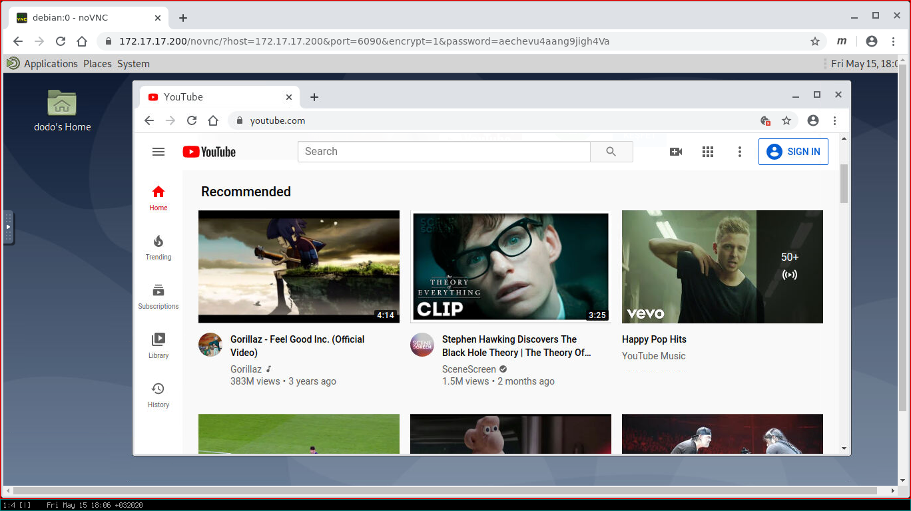

dodo
====
Desktop on [Digital Ocean](https://www.digitalocean.com/?refcode=92b0165840d8)

This script install a [MATE](https://mate-desktop.org/) desktop on the
[Debian Buster](https://www.debian.org/) droplet (Digital Ocean's cloud
computer) and you can use it via the web browser.

A team can share the same desktop session at the same time. It's very suitable
for the collaboration or for the remote demonstration. It's possible to run
different operating systems at the same session via virtualization too.

Thanks to [noVNC](https://github.com/novnc/noVNC),
[x11vnc](http://www.karlrunge.com/x11vnc/) and
[websockify](https://github.com/novnc/websockify)

Create a new Debian Buster droplet and run the following commands as `root`:

```bash
wget https://raw.githubusercontent.com/emrahcom/dodo/master/dodo
bash dodo
```


